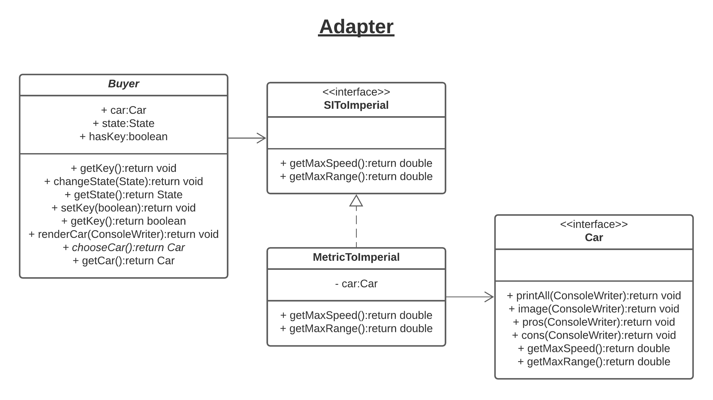
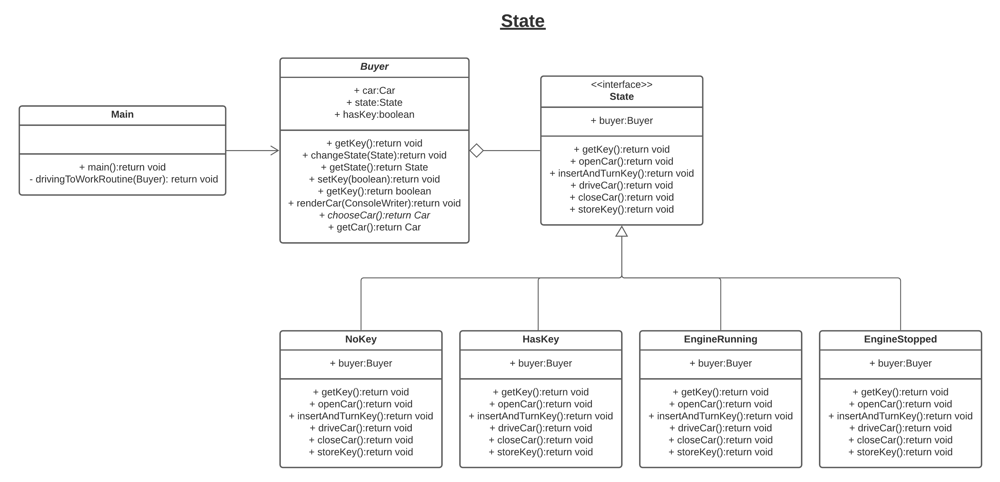
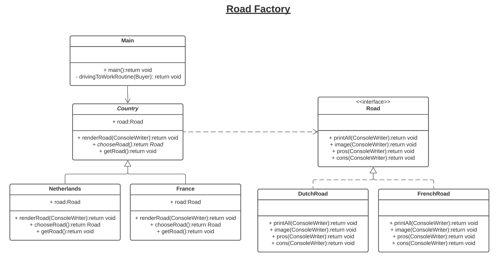
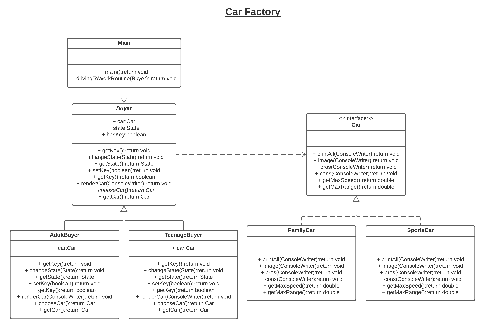
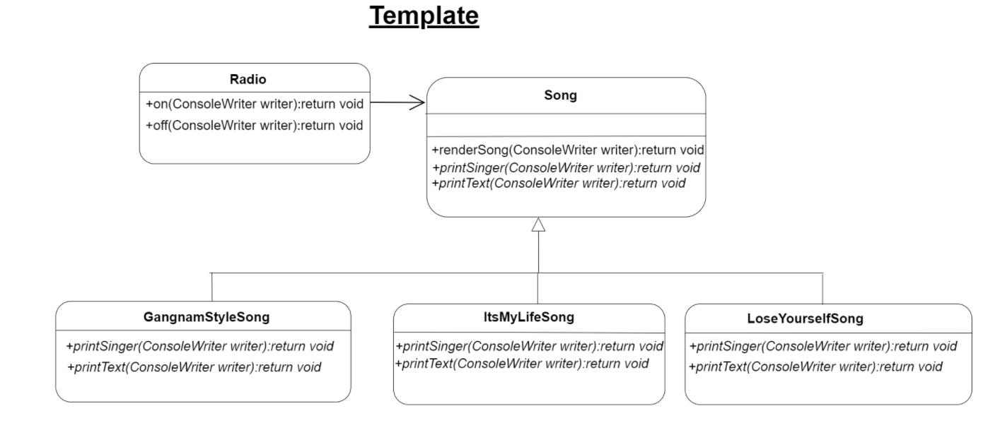
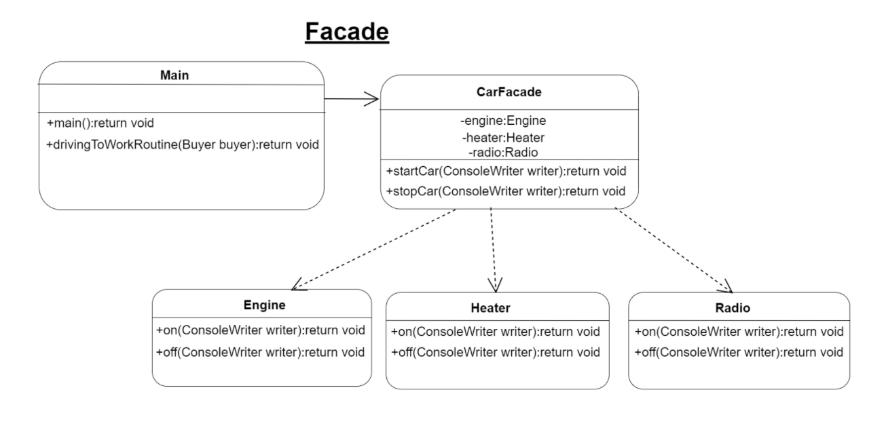

# Software Design - ProgramSDE

GitHub Repository: https://github.com/AxelZublena/ProgramSDE

## Table of Content
1. [Introduction](#introduction)
2. [Adapter Design Pattern](#adapter-design-pattern)
3. [State Design Pattern](#state-design-pattern)
4. [Road Factory Design Pattern](#road-factory-design-pattern)
5. [Car Factory Design Pattern](#car-factory-design-pattern)
6. [Template Design Pattern](#template-design-pattern)
7. [Facade Design Pattern](#facade-design-pattern)
8. [Authors](#authors)

## Introduction 
The application gives you the opportunity to hide for a little bit from reality. There you can choose to be an adult or a teenager. As a result, the most appropriate car would be suggested to you and you will be able to decide to drive the car to work or during holidays. In addition, you decide whether you will drive on the roads of the Netherlands or those in France. After the decision is made, you grab your key from home and go for a ride... 
 
To develop this application, we create a git repository, divided the tasks and committed three design patterns each. Bogomil worked on the Car Factory, Template and Facade, while I worked on the Adapter, State and Road Factory. To write this README.md file, we worked simultaneously on a word document, which was translated to a markdown format. 

## Adapter Design Pattern 
As per Refactoring Guru, an Adapter is a structural design pattern that allows objects with incompatible interfaces to collaborate. In our case, we want to adapt the SI (International System of Units) values of the Car object to imperial values (miles). 

The Car interface is composed of two methods returning SI units: getMaxSpeed() with kilometres per hour and getMaxRange() with kilometres. These methods are called from the Buyer class. This makes the Buyer class the Client class. In an adapter pattern, the client needs a Client Interface. This interface, in our case SIToImperial enables the client to call the create any adapter. While our client interface goal is to convert SI units to Imperial units, we just want to adapt the kilometres to miles. Therefore, we created MetricToImperial. It is from this class that the conversion of values happens. 

## State Design Pattern 
As per Refactoring Guru, a State is a behavioural design pattern that lets an object alter its behaviour when its internal state changes. It appears as if the object changed its class. In our case, we want to update the state and alter the behaviour of the Buyer class. 

The Buyer class is considered the Context. The context stores a reference to one state object that represents its current state, and delegates all the state-related work to that object. We created four states: NoKey, HasKey, EngineRunning and EngineStopped. Each state implements the same methods, but with different logic. 

In practice, the Main class and its private method drivingToWorkRoutine() will get different outputs depending on the states of its buyer object. 

## Road Factory Design Pattern 
As per Refactoring Guru, a Factory Method is a creational design pattern that provides an interface for creating objects in a superclass, but allows subclasses to alter the type of objects that will be created. 

In our application, we created Road objects: DutchRoad and FrenchRoad with an interface called Road. They are our “Products”. With the factory pattern, we added Creators: Netherlands and France that extends from the abstract class Country. A Country class holds a reference to a Road object. This Road object is defined when a France or a Netherlands object is created in the Main class.  

Finally, the Road Factory pattern is useful to our program because, depending on the user’s input, it can create the right objects. 

## Car Factory Design Pattern 
According to Refactoring Guru "Factory Method is a creational design pattern that provides an interface for creating objects in a superclass but allows subclasses to alter the type of objects that will be created". In our case, we have a Car interface with 6 methods that are overridden in the concrete car classes (SportsCar and FamilyCar). Consequently, all objects have the same interface and we can create as many objects as we want without changing the behaviour of the system. After that, we have the Buyer abstract class that is calling the Car interface in order to be the connection between the concrete buyers(AdultBuyer and TeenageBuyer) and the specific cars (FamilyCar and SportsCar). In the end, the Main class calls the Buyer class and, in that way, it has relation to the concrete buyers that owns concrete cars. 

## Template Design Pattern 
According to Refactoring Guru "Template Method is a behavioural design pattern that defines the skeleton of an algorithm in the superclass but lets subclasses override specific steps of the algorithm without changing its structure". In our case, we have an abstract class Song that has a public method (renderSong) and two abstract methods (printSinger and printText). These abstract methods are overridden in the three concrete classes (GangamStyleSong, ItsMyLifeSong and LoseYourselfSong). This way, we can have as many songs as we want without changing the behaviour of the software. In the end, every song can be called by the Radio class through the Song abstract class. 

## Facade Design Pattern 
According to Refactoring Guru " Facade is a structural design pattern that provides a simplified interface to a library, a framework, or any other complex set of classes". In our case, we have CarFacade class that involves reference to the three different objects (Engine, Heater and Radio). As a result, it is possible to create methods that operate with the objects (startCar and stopCar methods). Then, the Main class uses the facade to call the startCar and stopCar methods. In this way, we can have as many objects as we want and work with their methods without breaking the code. 

## Authors
 
* **Bogomil Dochev**
* **Axel Zublena**
